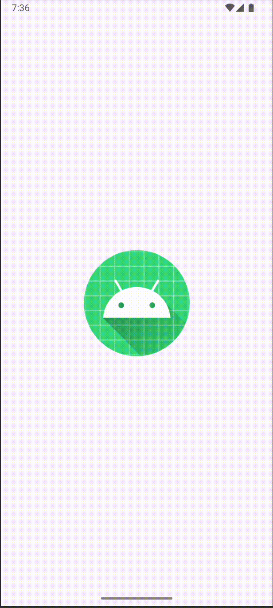
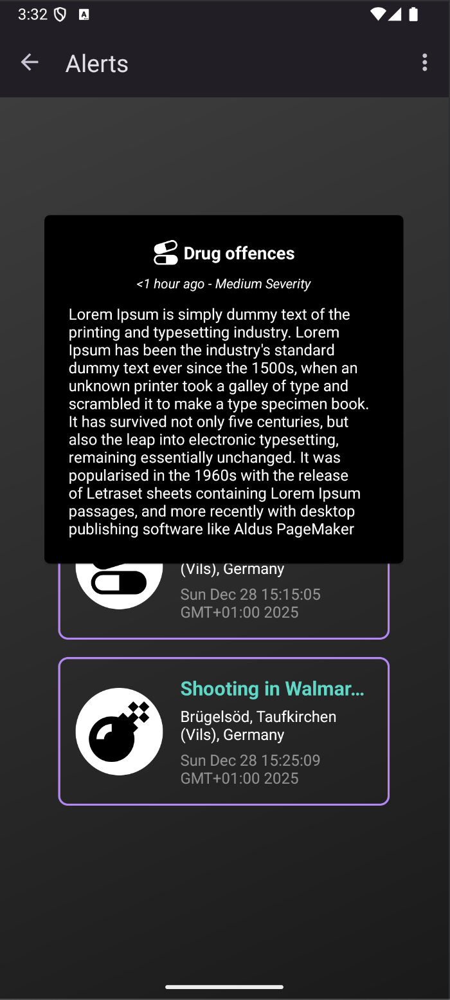

# PORA - Kolokvij naloga

Ime in priimek: **Tim Pangersic**  
Izbrana knjižnica: https://github.com/skydoves/Balloon

## Utemeljitev izbire

Aplikacijo iz druge naloge sem imel že predčasno zasnovano. Želel sem nadgraditi čelni del aplikacije. Po [urejenemu seznamu](https://github.com/mcxiaoke/awesome-kotlin) najbolj priljubljenih knjižnic za Kotlin sem naletel na knjižnico [Balloon](https://github.com/skydoves/Balloon). Knjižnica mi je predstavljala preprosto rešitev za dva problema, ki sem ju želel rešiti. Prvič so bile navigacijske ikone za uporabnika lahko nerazumljive, razmišljal sem o uvodni predstavitvi ("tutorial stanju"), kjer bi sledil, če je to uporabnikov prvi zagon aplikacije, in v tem primeru bi "popupi" s kliki na next vodili uporabnika čez ključne funkcionalnosti aplikacije. Drugi v primeru da gre za opis glavnega podatkovnega objekta je kartica v RecyclerView-u bila prevelika in moteča za uporabnika. Smiselno je pokazati celoten objekt samo ob kliku na "preberi več" ali ob kliku na kartico. Prikaz preprostega dialoga se mi je zdel boljša rešitev z vidika uporabniške izkušnje v primerjavi s fragmentom za podrobnosti. Izbira je bila dokončna ob pregledu primerov na github strani, ki je namigovala na zelo preprosto uporabo in možnost [sekvenčnega prikazovanja](https://github.com/skydoves/Balloon#show-up-balloon-sequentially) popupov, ki bi bil smiselen za tutorial.

## Prednosti in slabosti

:white_check_mark: Customizacija: podpora za custom layoute, puščice, barve, besedilo, ..  
:white_check_mark: Animacije: privzete animacije (fade, overshoot, elastic, circular...)  
:white_check_mark: Sekvenčno prikazovanje popupov  
:white_check_mark: Varnost pred memory leakom, integracija Android življenjskega cikla preko setLifecycleOwner() metode  
:white_check_mark: Preprosta uporaba  
:x:  Minimalna verzija android apija – Requires API 21+   
:x:  Dodatne odvisne knjižnice ("dependencies"), povečanje velikosti aplikacije

## Licenca

**Apache License 2.0**: Open-source licenca, ki dovoljuje uporabo za komercialne namene, modifikacijo knjižnice, distribucijo in privatno uporabo

## Število uporabnikov

Aplikacija beleži približno 800 000 mesečnih prenosov. 3900 zvezdic na Githubu in 307 forkov. To kaže na popularnost knjižnice in pozitiven odziv uporabnikov.

## Vzdrževanje

Knjižnica je odprtokodna, kar pomeni, da jo vzdržuje publika. V času pisanja ima 31 vzdrževalcev, pri nadgradnjah in vzdrževanju pa lahko prispeva kdorkoli. Glavni developer je [skydoves](https://github.com/skydoves), ki je zelo aktiven in priznan v android odprtokodnem svetu. 
Knjižnica je aktivno vzdrževana z pogostimi posodobitvami odvisnosti ("dependencies bumps"), beleži 1410 commitov, zadnja verzija pa je bila objavljena 28. decembra 2025. 

## Časovna in prostorska zahtevnost

**Časovna zahtevnost**: O(1) Za prikaz (inflating view-ja, pozicioniranje) in odmik dialoga, nikakršnih zank, ki bi povečale časovno zahtevnost.

**Prostorska zahtevnost**: O(1) Vsaka instanca ballona (dialoga) drži svojo konfiguracijo in view hierarhijo. Knjižnica je lightweight, prostorska zahtevnost temelji predvsem na kompleksnosti custom layoutov ali slik. 


## Primer uporabe

Touturial manager, skrbi za prikaz, in zapiranje balloonov

```
class TutorialManager(private val activity: MainActivity) {

    private var currentBalloon: Balloon? = null

    fun startTutorial() {
        val navHostFragment = activity.supportFragmentManager
            .findFragmentById(R.id.nav_host_fragment_content_main) as NavHostFragment
        val firstFragment = navHostFragment.childFragmentManager
            .fragments?.firstOrNull() as FirstFragment

        firstFragment.view?.post {
            val nextButton = firstFragment.view?.findViewById<Button>(R.id.button_first)
            nextButton?.let { showFirstBalloon(it) }
        }
    }

    private fun showFirstBalloon(nextButton: View) {
        currentBalloon = Balloon.Builder(activity)
            .setText("Press here to navigate to the second fragment")
            .setTextColorResource(android.R.color.white)
            .setTextSize(16f)
            .setPadding(12)
            .setArrowSize(10)
            .setArrowOrientation(ArrowOrientation.BOTTOM)
            .setArrowPosition(0.5f)
            .setCornerRadius(8f)
            .setBackgroundColorResource(android.R.color.holo_blue_dark)
            .setBalloonAnimation(BalloonAnimation.FADE)
            .setBalloonHighlightAnimation(BalloonHighlightAnimation.SHAKE)
            .setLifecycleOwner(activity)
            .setDismissWhenClicked(true)
            .setDismissWhenTouchOutside(true)
            .setOnBalloonDismissListener {
                showSecondBalloon()
            }
            .build()

        currentBalloon?.showAlignTop(nextButton)
    }

    private fun showSecondBalloon() {
        currentBalloon = Balloon.Builder(activity)
            .setText("Press here to send a message")
            .setTextColorResource(android.R.color.white)
            .setTextSize(16f)
            .setPadding(12)
            .setArrowSize(10)
            .setArrowOrientation(ArrowOrientation.BOTTOM)
            .setArrowPosition(0.82f)
            .setCornerRadius(8f)
            .setBackgroundColorResource(android.R.color.holo_blue_dark)
            .setBalloonAnimation(BalloonAnimation.FADE)
            .setBalloonHighlightAnimation(BalloonHighlightAnimation.SHAKE)
            .setLifecycleOwner(activity)
            .setDismissWhenClicked(true)
            .setDismissWhenTouchOutside(true)
            .build()

        currentBalloon?.showAlignTop(activity.binding.fab)
    }

    fun dismissAll() {
        currentBalloon?.dismiss()
        currentBalloon = null
    }
}
```

Uporaba v main activitiju

```
override fun onCreate(savedInstanceState: Bundle?) {
  super.onCreate(savedInstanceState)
  ...
  tutorialManager = TutorialManager(this)
  tutorialManager.startTutorial()
}

override fun onDestroy() {
  super.onDestroy()
  tutorialManager.dismissAll()
}
```


### Zaslonski posnetek

 </img>


## Primer uporabe v drugi aplikaciji


Dodajanje listenerja na recycler view item
```kotlin
holder.itemView.setOnClickListener { view ->
	clickListener.onMessageClick(message, view)
}
```
Definiramo odprtje balloon dialoga ob kliku na message. V setLayout smo poslali naš custom xml za izgled dialoga. Z getContentView na balloon lahko dostopamo do fieldov v layoutu in jim nastavimo vrednosti. Dodali smo eno od privzetih animacij "ELASTIC" na prikaz balloona.
```kotlin
override fun onMessageClick(message: Message, view: View) {
	val iconResource = when (message.type) {
		"Robbery" -> R.drawable.crime_robbery		
		"Arson" -> R.drawable.crime_arson	
		...
		else -> R.drawable.annotation_alert
    }
	val balloon = context?.let {
		Balloon.Builder(it)
		.setWidthRatio(0.8f)
		.setHeight(BalloonSizeSpec.WRAP)
		.setPadding(10)
		.setLayout(R.layout.balloon_message)
		.setArrowSize(0)
		.setBalloonAnimation(BalloonAnimation.ELASTIC)
		.build()
	}
	balloon?.getContentView()?.let { contentView ->
		contentView.findViewById<ImageView>(R.id.balloonIcon).setImageResource(iconResource)
		contentView.findViewById<TextView>(R.id.balloonType).text = message.type
		contentView.findViewById<TextView>(R.id.balloonTime).text = "${message.timeOccurred} - ${message.severity} ${getString(R.string.severity)}"
		contentView.findViewById<TextView>(R.id.balloonText).text = message.text
	}
	balloon?.showAtCenter(view)
  }
```

Implementiramo custom layout za popup.
```xml
<?xml version="1.0" encoding="utf-8"?>
<androidx.constraintlayout.widget.ConstraintLayout xmlns:android="http://schemas.android.com/apk/res/android"
    xmlns:app="http://schemas.android.com/apk/res-auto"
    android:layout_width="match_parent"
    android:layout_height="wrap_content"
    android:padding="12dp">
    <ImageView
        android:id="@+id/balloonIcon"
        android:layout_width="24dp"
        android:layout_height="24dp"
        android:layout_marginEnd="4dp"
        app:tint="@color/white"
        app:layout_constraintHorizontal_chainStyle="packed"
        app:layout_constraintTop_toTopOf="parent"
        app:layout_constraintStart_toStartOf="parent"
        app:layout_constraintEnd_toStartOf="@id/balloonType" />
    <TextView
        android:id="@+id/balloonType"
        android:layout_width="wrap_content"
        android:layout_height="wrap_content"
        android:textColor="@color/white"
        android:textSize="16sp"
        android:textStyle="bold"
        app:layout_constraintTop_toTopOf="@id/balloonIcon"
        app:layout_constraintBottom_toBottomOf="@id/balloonIcon"
        app:layout_constraintStart_toEndOf="@id/balloonIcon"
        app:layout_constraintEnd_toEndOf="parent" />
    ...
</androidx.constraintlayout.widget.ConstraintLayout>
```
Izjema pri uporabi bindinga na custom layoutu. 
```
FATAL EXCEPTION: main
java.lang.ClassCastException: com.skydoves.balloon.radius.RadiusLayout
cannot be cast to androidx.constraintlayout.widget.ConstraintLayout
```
Problem, ker balloon "wrapa" naš layout v RadiusLayout, getContentView() vrača ta wrapper, ne pa naš ConstraintLayout. View binding's bind() pričakuje, da bo root ConstraintLayout. Namesto bindinga uporabimo findViewById.

### Zaslonski posnetek

 </img>
